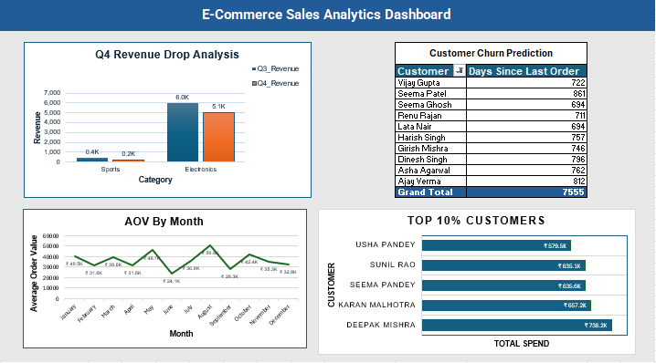

# E-Commerce Q4 Sales Analytics Dashboard

> **SQL → Excel Pipeline | Revenue Drop Investigation | Customer Insights | 2025**

---

## Project Overview

A complete end-to-end data analytics project investigating Q4 2025 revenue performance of an e-commerce business. Raw transactional data was analyzed using **4 SQL queries** (CTEs, Window Functions, Date Functions), and results were visualized in an **Excel dashboard** to surface actionable business insights.

---

## Business Problem

> *"Q4 revenue dropped significantly. Which categories underperformed? Who are the highest-value customers? What is the churn risk?"*

**Objective:** Identify revenue drop drivers, segment high-value customers, analyze AOV trends, and flag churn-risk customers.

---

## Executive Summary

| Metric | Value |
|--------|-------|
| **Sports Q3 Revenue** | ₹4,15,437 |
| **Sports Q4 Revenue** | ₹2,39,451 |
| **Sports Q4 Drop** | -42.4% |
| **Electronics Q3 Revenue** | ₹59,79,043 |
| **Electronics Q4 Revenue** | ₹50,51,859 |
| **Electronics Q4 Drop** | -15.5% |
| **Highest AOV Month** | August (₹50,765) |
| **Lowest AOV Month** | June (₹24,081) |
| **Top Customer Spend** | Deepak Mishra — ₹7,38,214 |
| **Churn Risk Customers** | 410 customers (90+ days inactive) |

---

## Key Findings

### 1. Q4 Revenue Drop by Category
- **Sports** dropped **-42.4%** (Priority Rank 1 — most urgent)
- **Electronics** dropped **-15.5%** (Priority Rank 2)
- Both categories underperformed significantly vs Q3
- **Action:** Promotional campaigns + inventory clearance needed

### 2. Top 10% High-Value Customers
- **50 customers** identified in top 10% percentile (NTILE)
- **Deepak Mishra** is highest spender at ₹7,38,214
- Top 5 customers: Deepak Mishra, Karan Malhotra, Seema Pandey, Sunil Rao, Usha Pandey
- **Action:** VIP retention program for top spenders

### 3. Monthly AOV Trend (2025)
- Peak AOV: **August ₹50,765** (highest month)
- Second peak: **October ₹42,397** (festive season)
- Lowest AOV: **June ₹24,081**
- **Action:** Replicate August/October promotional strategy in low-AOV months

### 4. Customer Churn Prediction
- **410 customers** inactive for 90+ days with 2+ past orders
- High churn-risk signals revenue loss potential
- **Action:** Immediate win-back email campaign

---

## Business Recommendations

### Immediate (Week 1)
- Launch **Sports clearance sale** (highest priority drop -42.4%)
- Trigger **win-back campaign** for 410 inactive customers

### Short-Term (Month 1)
- Introduce **VIP Gold Program** for Top 10% spenders
- Investigate Electronics -15.5% drop (supply/demand issue?)

### Long-Term (Quarter)
- Replicate August promotions in June (low-AOV month)
- Reduce customer concentration risk in top 10%

---

## Technical Stack

| Tool | Usage |
|------|-------|
| **MySQL** | Data extraction, transformation, business logic |
| **Excel** | Pivot Tables, Charts, Dashboard, Power Pivot |
| **SQL CTEs** | Multi-step query logic (Revenue comparison) |
| **Window Functions** | NTILE(10), DENSE_RANK() for customer segmentation |

---

## SQL Queries

| # | Analysis | Key SQL Concepts |
|---|----------|-----------------|
| 1 | Q4 Revenue Drop by Category | CTEs, JOIN, DENSE_RANK(), WHERE filter |
| 2 | Customer Churn Prediction | CTE, DATEDIFF(), HAVING, ORDER BY |
| 3 | Top 10% Customers | NTILE(10), DENSE_RANK(), GROUP BY |
| 4 | Monthly AOV Trend | MONTHNAME(), COUNT(), SUM(), ROUND() |

Full queries: [queries.sql](queries.sql)

---

## Dataset

| Property | Detail |
|----------|--------|
| Type | Synthetic (practice dataset) |
| Orders | 1,000 rows |
| Customers | 500 rows |
| Period | January–December 2025 |
| Categories | Electronics, Sports |

---

## Skills Demonstrated
- SQL → CTEs, Window Functions, Date Functions, Aggregations, Joins
- Excel → Pivot Tables, Charts, Dashboard Layout, Power Pivot Measures
- Analytics → Revenue Attribution, Churn Analysis, Customer Segmentation, AOV
- Business → Impact Quantification, Priority Ranking, Actionable Recommendations

---

## Related Projects

[Sales & Customer Performance Dashboard — Power BI](https://github.com/Payaljain05/Sales-Customer-performance-dashboard)

---

## Author

**Payal Jain**
MCA Student | Aspiring Data Analyst
[GitHub](https://github.com/Payaljain05)

---

*If you found this project helpful, please star the repository!*

